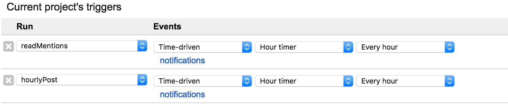

Learn on Twitter
===

This repository has a collection of Google Apps Scripts to run a Twitter bot which sends its followers learning topics periodically. You can easily setup your own Twitter bot using these scripts by following the setup section.

Example: https://twitter.com/LearnOnTwit

# Bot Features
* Fetches data sources and sends scraped results to followers periodically.
    * Users can choose (1) what data source and (2) when they want to receive a tweet by mentioning the bot.

    ```
    Usage: @LearnOnTwit op([add|remove]) time([0-23]) data_source([1-DATA_SOURCE.length])
    e.g., @LearnOnTwit add 7 1 1
    ```

    * Users' preferences are stored in a Google Sheets.
* Users can check what the bot sent to them by checking a Google Sheets.
    * Example: [Learn On Twitter](https://goo.gl/RXcnBD).


# How to set up your own bot
## Preparation
1. Make a Google Apps Scripts project on https://script.google.com.
1. Pull this repository using https://github.com/leonhartX/gas-github.
1. Copy the script URL `https://script.google.com/macros/d/{PROJECT_ID}`.
1. Create a Twitter application on https://apps.twitter.com/app/.
   * Use the script URL as `CallbackURL`.
1. Write down `API key` and `API Secret`.
1. Go to `File > Project Properties > Script Properties`.
1. Set the key and secret you wrote down as `API_KEY` and `API_SECRET` respectively.
1. Add libraries by following the next section.

### Dependency: libraries
NOTE: Choose the latest version.

1. Go to `Resource > Library...`.
1. Add `Oauth1` by putting `1CXDCY5sqT9ph64fFwSzVtXnbjpSfWdRymafDrtIZ7Z_hwysTY7IIhi7s`.
1. Add `Parser` by putting `M1lugvAXKKtUxn_vdAG9JZleS6DrsjUUV`.


## Authorize and test
1. Run `getOAuthURL`.
1. Check the log and copy the link.
1. Open the link and accept what it says.

After completing the above processes, run `testTweet` function in `test/twitter/api.gs` as a test, which posts a `Yeah!` tweet. Before running the function, you'll be asked to authorize the permissions the scripts needs. Please accept them.


## Usage
1. Set GAS triggers (`Edit > Current project's triggers`).
    * Set a GAS hourly trigger to `readMentions` function in `src/read_mentions.gs`.
        * This function checks mentions to the bot and modify followers' configuration if there are requests.
    * Set a GAS hourly trigger to `hourlyPost` function in `src/post.gs`.
        * This function checks users' preference which is a Google Sheets and sends tweets to followers according to the configuration.

The result should be like this:



# Implemented Learning Data Sources
* [TED](https://www.ted.com/): The talk shown at the top of the index page.
* [TED Short Talk](https://www.ted.com/talks?sort=newest&language=en&duration=0-6): A randomly selected short (0-6 min) talk on the list.
* [Learner's Dictionally](http://www.learnersdictionary.com/word-of-the-day): Word of the day.
* [Techcrunch Japan](https://jp.techcrunch.com/popular/): The first talk on the popular list with its English article URL if available.
* [xkcd](https://xkcd.com/): A randomly chosen comic.
* [WIRED JP](https://wired.jp/rssfeeder/): The first article in a feed with its English article URL if available.
* (To be added)


# License
MIT
